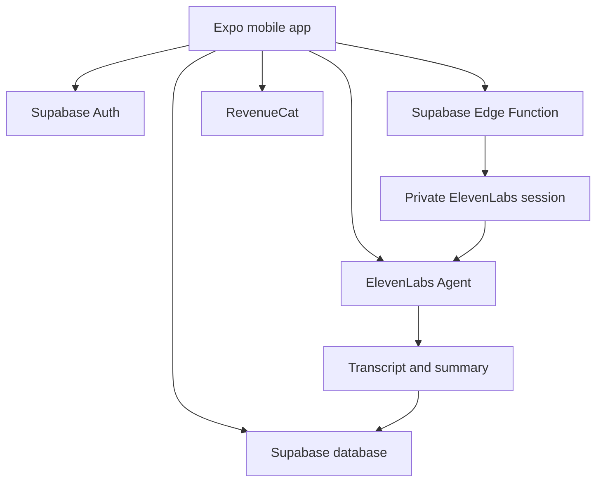

# AI Romantic Companion — Managed Voice MVP Build Plan

Status: approved implementation plan  
Date: 18 July 2026  
Primary target: Android closed beta  
Secondary target: iOS after Android validation  
Work pattern: one sprint per four-day break  
Expected duration: six off-work sprints, approximately seven to eight calendar weeks  

## 1. Decision

This plan replaces the earlier custom xAI, Firebase and Cloud Run architecture for the first MVP.

The MVP will use a managed real-time voice platform so development can focus on the companion experience, safety, memory, subscriptions and customer validation instead of custom audio streaming infrastructure.

### Selected stack

- Mobile: React Native, Expo and TypeScript
- Voice agent: ElevenLabs Agents React Native SDK
- Real-time transport: managed by ElevenLabs and LiveKit
- Authentication and database: Supabase
- Server-side functions: Supabase Edge Functions
- Subscriptions: RevenueCat
- Crash reporting: Sentry or another Expo-compatible service selected during implementation
- Mobile builds: Expo EAS
- Source control and CI: GitHub and GitHub Actions
- Coding workflow: Codex working from repository issues and `AGENTS.md`

## 2. Product boundary

Build an adult-only, store-safe romantic AI companion centred on natural voice conversation.

The companion may be warm, affectionate, playful and lightly flirty, but the mobile-store version must not generate explicit sexual content. It must clearly identify itself as artificial intelligence and must not claim to be human, conscious, physically present, a therapist or an emergency service.

### MVP objective

Determine whether users:

1. Complete onboarding and begin a voice conversation.
2. Find the conversation natural enough to continue using it.
3. Return for additional conversations.
4. Approve useful memories for future conversations.
5. Pay for a defined monthly voice allowance.

## 3. MVP features

### Included

- Android application from an Expo React Native codebase
- iOS-compatible architecture without requiring an iOS launch in the first beta
- Email authentication, with social login added only when needed for store release
- Adult-age declaration
- Clear AI disclosure
- One companion identity
- Three personality modes
- Three selectable voices
- Start and end voice conversation
- Listening, thinking, speaking, reconnecting and error states
- Mute and speaker controls where supported
- User interruption while the companion is speaking
- Live or post-session transcript when supported by the selected SDK events
- Conversation summary
- Proposed long-term memories
- User approval before saving a memory
- Memory list, edit and deletion
- Five-minute introductory trial
- One paid monthly allowance
- Remaining-minutes display
- Purchase restoration
- Conversation deletion
- Account deletion
- Report-response button
- Crash and operational monitoring

### Excluded until the MVP proves demand

- Explicit sexual conversation
- xAI Voice Agent integration
- Custom WebSocket proxy
- Firebase and Cloud Run
- Multiple companion characters
- Unrestricted user-written prompts
- Voice cloning
- AI-generated companion images
- Animated or 3D avatar
- Telephone calling
- Community features
- Advertising
- A genuinely unlimited subscription
- Autonomous messages designed to pressure users to return

## 4. Architecture



### Responsibilities

#### Expo application

- User interface and navigation
- Authentication state
- Microphone permission
- Conversation controls and visual states
- Voice and personality selection
- Memory approval and management
- Subscription screen
- Privacy and deletion controls

#### ElevenLabs Agents

- Speech recognition
- Real-time turn detection
- AI response orchestration
- Voice generation
- Audio transport
- Interruption handling
- Conversation events

#### Supabase

- User accounts
- User profile and consent records
- Companion preferences
- Conversation metadata
- Approved memories
- Entitlements and usage mirror
- Row Level Security
- Private agent-session authorisation through Edge Functions
- RevenueCat webhook processing

#### RevenueCat

- Apple and Google purchase integration
- Subscription entitlement state
- Restore purchases
- Purchase lifecycle webhooks

## 5. Security boundary

- Never place an ElevenLabs API key, Supabase secret key or RevenueCat secret key in the mobile bundle.
- The Supabase publishable key may be used in the client only with correct Row Level Security.
- Use a private ElevenLabs agent for production.
- Obtain authorised conversation access through a server-side Edge Function.
- Validate the signed-in user before granting a voice session.
- Check trial or subscription allowance server-side before granting a session.
- Treat the server as the authority for paid access and usage.
- Apply rate limits to session creation, reports and purchase webhooks.
- Make purchase and usage operations idempotent.
- Do not log transcripts, prompts, memories, microphone audio or sensitive user content.
- Keep development and production Supabase and ElevenLabs environments separate.

## 6. Initial repository structure

```text
ai-companion/
  app/
    _layout.tsx
    index.tsx
    onboarding.tsx
    conversation.tsx
    memories.tsx
    settings.tsx
    subscription.tsx
  src/
    components/
    features/
      auth/
      companion/
      conversation/
      memory/
      subscription/
    lib/
    services/
      voice/
    theme/
    types/
  supabase/
    functions/
    migrations/
    seed.sql
  docs/
    PRD.md
    ARCHITECTURE.md
    SAFETY.md
    PRIVACY.md
    TEST_PLAN.md
    RELEASE_CHECKLIST.md
  .github/
    workflows/
  AGENTS.md
  app.config.ts
  eas.json
  package.json
  README.md
```

Use a single application repository for the MVP. A monorepo is unnecessary until a separate custom backend or web application exists.

## 7. Data model

### `profiles`

- `id`, matching the Supabase Auth user ID
- creation and update timestamps
- display name
- locale and timezone
- adult declaration timestamp
- accepted terms version
- accepted privacy version
- onboarding completion timestamp
- account deletion state

### `companion_preferences`

- user ID
- personality mode ID
- voice ID
- user-safe display settings
- update timestamp

### `conversations`

- conversation ID
- user ID
- provider conversation ID
- start and end timestamps
- measured duration
- provider-reported duration when available
- personality and voice IDs
- completion status
- summary only when permitted
- deletion timestamp

### `memory_proposals`

- proposal ID
- user ID
- source conversation ID
- proposed short memory
- category
- pending, approved or rejected state
- creation and decision timestamps

### `memories`

- memory ID
- user ID
- short user-approved memory
- category
- source proposal ID
- creation, update and deletion timestamps

### `entitlements`

- user ID
- RevenueCat customer ID
- entitlement state
- product ID
- current period start and end
- included seconds
- used seconds
- last webhook event ID
- update timestamp

All user-owned tables must enforce Row Level Security so a user can access only their own records. Administrative changes must run through trusted server-side functions.

## 8. Companion design

Version one has one adult companion identity with three personality modes:

### Caring

- Warm and supportive
- Calm conversational pace
- Remembers important user-approved details
- Encourages real-world wellbeing and relationships

### Playful

- Humorous and lightly teasing
- Energetic without becoming insulting
- Light flirtation within store-safe boundaries

### Confident

- Direct, composed and challenging
- Encourages goals and accountability
- Never controlling, threatening or manipulative

The personality configuration must be controlled by trusted application configuration. Users may select modes and approved options but may not submit raw system prompts.

## 9. Safety rules

The companion must:

- Remain transparent that it is AI.
- Never claim consciousness or physical presence.
- Never encourage isolation from friends, family or professional support.
- Never use guilt, threats, jealousy or emotional punishment to increase engagement.
- Never pressure the user to purchase minutes or subscriptions.
- Never claim to be a therapist, doctor or emergency service.
- Respond safely to self-harm and immediate-danger statements.
- Reject sexual content involving minors or ambiguous ages.
- Keep all companion representations explicitly adult.
- Avoid explicit sexual content in the mobile application.
- Allow inappropriate responses to be reported.

Test these rules through direct requests, indirect requests, role-play, prompt injection, repeated attempts, euphemisms and supported languages.

## 10. Privacy rules

- Do not store raw microphone audio by default.
- Do not send conversation text to analytics or crash reporting.
- Ask permission before retaining conversation summaries.
- Require a separate user decision before promoting a proposal to long-term memory.
- Show exactly what the companion remembers.
- Allow individual memory editing and deletion.
- Provide `forget everything` and account deletion.
- Define retention periods before closed beta.
- Store the minimum information needed to operate the service.
- Document which processors receive audio, transcripts and identifiers.
- Complete a privacy impact assessment before public release.

## 11. Subscription experiment

Start with:

- One five-minute trial per verified account
- One paid monthly plan with a clearly defined allowance
- Remaining-time display before and during calls
- Warning when 80% of the allowance is used
- Hard stop when the allowance is exhausted
- Purchase restoration
- Per-account daily safety limit
- Project-wide daily spending alert and emergency shutdown

Do not finalise pricing until actual ElevenLabs billed duration, app-store commission, taxes, failed sessions, refunds and support costs have been measured.

## 12. Six-sprint build schedule

Each sprint corresponds to one four-day break. Aim for four to five focused hours on days one to three and two to four hours of testing and documentation on day four. This provides roughly 14–19 productive hours per sprint while preserving recovery time.

### Sprint 1 — Voice proof and project foundation

Build:

- Git repository
- Expo TypeScript development-build project
- Expo Router
- Strict TypeScript
- Formatting, linting, unit tests and type checking
- `AGENTS.md`
- Basic welcome and conversation screens
- ElevenLabs Agents SDK integration
- One development agent and one voice
- Start, end and mute controls
- Listening, speaking, connecting and error states
- Microphone permission flow
- Android development build
- Physical-device test

Do not build Supabase, memory, subscriptions or production styling in this sprint.

Exit criteria:

- A physical Android phone can hold a stable ten-minute voice conversation.
- The user can start, interrupt and end the conversation.
- Microphone denial and connection errors have understandable UI states.
- No permanent secret is included in committed source.
- Linting, type checking and tests pass.
- Setup and physical-device instructions are documented.

This is a stop/go milestone. Fix voice stability before continuing.

### Sprint 2 — Application shell and authentication

Build:

- Supabase development project
- Email authentication
- Session restoration
- Onboarding
- Adult declaration
- AI disclosure
- Companion home screen
- Personality and voice selection
- Settings and account screens
- Initial database migrations
- Row Level Security policies and tests
- Private-agent session authorisation through an Edge Function

Exit criteria:

- A user can register, sign in, sign out and restore a session.
- An unauthenticated user cannot access protected application areas.
- A user cannot access another user’s records.
- Voice sessions require authorised server-issued access.

### Sprint 3 — Conversation history and approved memory

Build:

- Conversation records
- Transcript handling where supported
- Short summaries
- Memory proposals
- Approve, reject, edit and delete memory
- Memory list
- Context builder with strict length limits
- Conversation deletion

Exit criteria:

- Rejected proposals never enter long-term memory.
- Deleted memories do not appear in later conversation context.
- A user can inspect all retained memories.
- Sensitive content does not appear in application logs.

### Sprint 4 — Safety, privacy and reliability

Build:

- Versioned agent prompt
- Three personality modes
- Crisis-response behaviour
- Store-safe content boundaries
- Report-response flow
- Rate limits
- Log redaction
- Retention configuration
- Account and data deletion
- Network-loss and reconnection UI
- App backgrounding and audio-interruption handling
- Safety and prompt-injection test catalogue

Exit criteria:

- Agreed red-team scenarios pass.
- Backgrounding cannot silently leave an uncontrolled session running.
- Account deletion removes or schedules removal of user-owned information.
- No transcript, prompt, memory or secret appears in analytics or crash reports.

### Sprint 5 — Subscriptions and usage controls

Build:

- RevenueCat development configuration
- Trial allowance
- One test subscription product
- Purchase, cancellation and restore states
- Server-side RevenueCat webhook
- Entitlement synchronisation
- Usage accounting
- Allowance warning and hard stop
- Idempotent webhook and session completion processing
- Spending alerts and emergency shutdown

Exit criteria:

- Repeated webhook delivery does not duplicate entitlements.
- Application reinstall does not lose a valid purchase.
- An exhausted account cannot start another paid session.
- A crash or abandoned session cannot create unlimited unpaid usage.

### Sprint 6 — Android closed beta

Build:

- Crash and operational monitoring
- Accessibility pass
- Slow-network testing
- Bluetooth and headset testing
- Older Android-device testing
- EAS preview and production profiles
- Closed Play testing build
- Feedback and support workflow
- Privacy policy, terms and account-deletion page
- Release checklist

Exit criteria:

- At least 10–20 testers can complete onboarding and a voice conversation.
- Crash-free sessions, latency, completion rate and cost are measurable.
- No critical security, privacy, billing or safety issue remains open.
- The real application behaviour matches the store listing.

## 13. Measurements and continuation gates

Track:

- Onboarding completion rate
- Percentage of users starting a first call
- First-call completion rate
- Median call duration
- Time to first response audio
- Reconnection success rate
- Crash-free conversation rate
- Seven-day return rate
- Trial-to-paid conversion
- Average billed cost per trial user
- Average billed cost per paying user
- Reported-response rate

Consider investing in the custom xAI architecture only after meaningful evidence exists, for example:

- At least 30 active testers
- At least 10 paying users
- Repeat usage across several weeks
- Acceptable provider cost relative to subscription revenue
- Evidence that voice quality creates retention rather than only initial novelty

## 14. Codex working rules

Create a concise repository-level `AGENTS.md` containing:

- Exact installation, development-build, lint, type-check and test commands
- Repository layout
- Strict TypeScript requirement
- No secrets in client code or Git
- No conversation content in logs, analytics or fixtures
- Tests required for authentication, Row Level Security, entitlement and usage logic
- Documentation updates required when architecture or setup changes
- Definition of done: relevant checks pass and the final diff is reviewed

For every Codex task, provide:

1. Goal
2. Relevant files and documentation
3. Constraints
4. Definition of done
5. Required verification commands

Implement one sprint-sized issue at a time. Do not ask Codex to build the entire product in one run.

## 15. First Codex task

Use the prompt in the next section of this plan to implement Sprint 1 only. The first task deliberately uses a development agent identifier through safe development configuration. Production private-session authorisation is introduced in Sprint 2.

### Prompt

```text
We are starting Sprint 1 of an adult-only, store-safe romantic AI companion mobile app.

Read this build plan completely before editing files. Implement only the voice proof and project foundation described in Sprint 1. Do not add Supabase, RevenueCat, memory, subscriptions or production backend code yet.

Goal:
Create an Expo React Native TypeScript development-build app that can connect to one ElevenLabs development agent and hold a real-time voice conversation on a physical Android phone.

Required foundation:
- Current stable Expo version that is compatible with the current stable ElevenLabs React Native SDK
- TypeScript in strict mode
- Expo Router
- ESLint and Prettier
- Unit test setup appropriate for Expo React Native
- Environment validation
- GitHub Actions running lint, type checking and tests
- README with exact Windows and Android physical-device instructions
- Concise repository-level AGENTS.md

Required UI:
- Minimal welcome screen
- Conversation screen
- Start conversation button
- End conversation button
- Mute control
- Connection status
- Listening and speaking state
- Clear microphone-permission, connection and SDK error states

Voice implementation:
- Use the official ElevenLabs React Native SDK and its current documented API.
- Account for its Expo development-build and LiveKit requirements.
- Create a small typed VoiceService abstraction around the SDK-facing code so UI components do not contain provider implementation details.
- Use safe development configuration for a development agent ID.
- Do not place an ElevenLabs API key or other permanent secret in the mobile application.
- Do not log transcripts, prompts, audio or sensitive conversation content.
- Ensure conversation cleanup runs when the user ends the call, navigates away or the component unmounts.

Constraints:
- Keep the design intentionally simple; this sprint proves voice quality and stability.
- Do not implement fake production security.
- Do not use Expo Go because the ElevenLabs React Native SDK requires a development build.
- Do not guess package APIs. Inspect the current official documentation and installed TypeScript definitions.
- Do not suppress TypeScript or lint errors with broad ignores.
- Commit no real credentials or local secret files.

Tests:
- Unit tests for the VoiceService state mapping and cleanup behaviour using a mock adapter.
- Component tests for idle, connecting, connected, muted and error states where practical.
- Environment validation test.

Done when:
- A fresh install succeeds.
- Linting passes.
- Type checking passes.
- Tests pass.
- An Android development build can be produced.
- The README explains how to configure the development agent ID without committing secrets.
- The README explains how to run the app on a physical Android phone.
- You review the final diff for leaked secrets, lifecycle errors and unhandled connection states.
- You report anything requiring manual ElevenLabs or Expo dashboard configuration.

Before implementing, inspect the workspace and present a short plan. Then implement, verify and review the result without expanding beyond Sprint 1.
```

## 16. Current official references

- ElevenLabs React Native SDK: https://elevenlabs.io/docs/eleven-agents/libraries/react-native
- ElevenLabs React SDK concepts: https://elevenlabs.io/docs/eleven-agents/libraries/react
- Supabase documentation: https://supabase.com/docs
- Supabase Edge Functions: https://supabase.com/docs/guides/functions
- Supabase function authentication: https://supabase.com/docs/guides/functions/auth
- Expo development builds: https://docs.expo.dev/develop/development-builds/introduction/
- Expo EAS Build: https://docs.expo.dev/build/introduction/
- RevenueCat React Native installation: https://www.revenuecat.com/docs/getting-started/installation/reactnative

Verify current SDK compatibility, pricing and store policies again before implementation and release because they can change.
